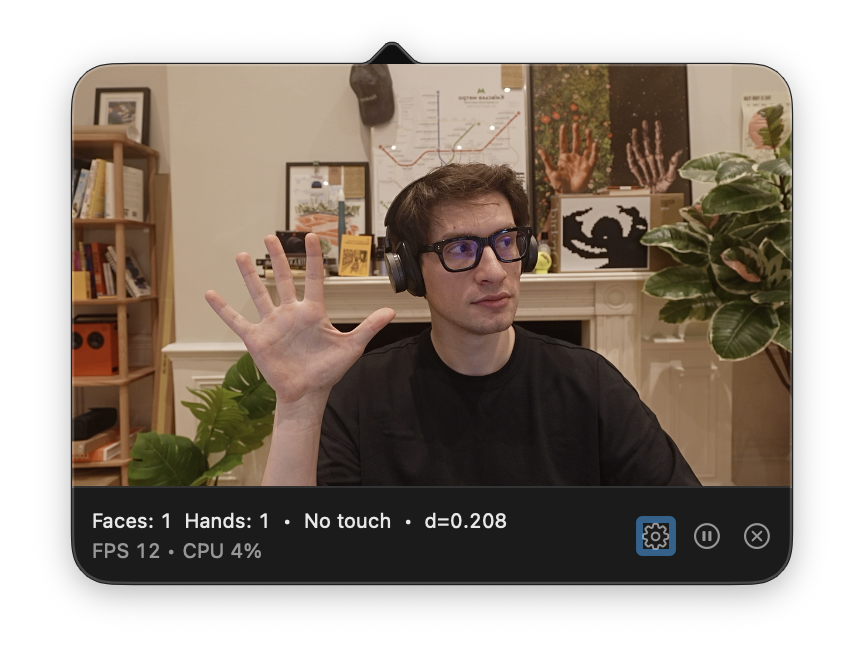
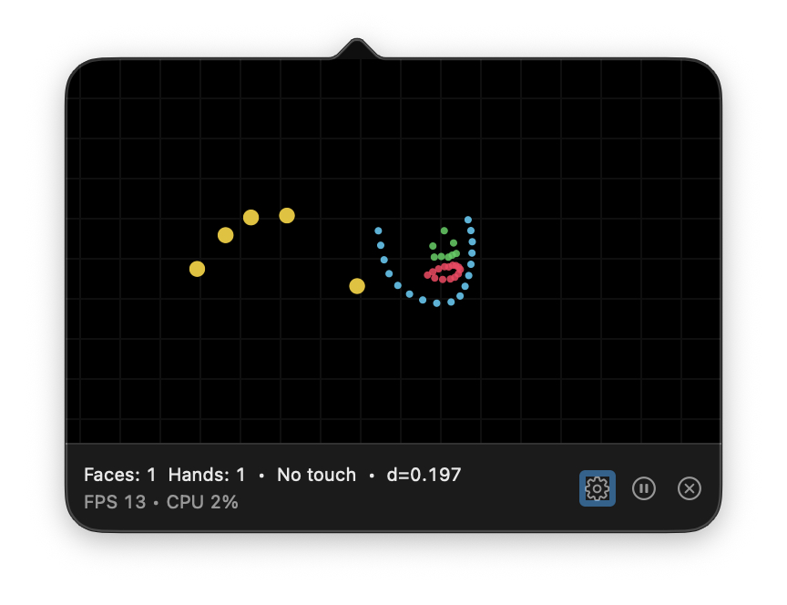

# Brrrrr

**Stop touching your face.** Brrrrr is a macOS menu bar app that uses your camera and on-device machine learning to detect when your hand approaches your face — and alerts you before you touch.

  

<p align="center">
  
  
</p>

<p align="center">
  <em>Left: Normal mode with live camera feed | Right: Geometry mode showing face and hand landmarks</em>
</p>

---

## Why Brrrrr?

We touch our faces **16–23 times per hour** on average. This transfers bacteria and viruses from surfaces to our eyes, nose, and mouth — the primary entry points for infections.

Brrrrr helps you build awareness and break the habit by providing real-time feedback whenever your hand gets close to your face.

---

## Features

### 🎯 Real-Time Detection
- Uses Apple Vision framework for face and hand detection
- Processes video frames entirely on-device
- Configurable processing rate (4–30 FPS) to balance accuracy vs. CPU usage

### 🔔 Customizable Alerts
- **Sound alerts** — Choose from system sounds with adjustable volume
- **Screen flash** — Full-screen color flash with customizable color and opacity
- **Cooldown timer** — Prevents alert fatigue with configurable delay between alerts

### 🖥️ Menu Bar Integration
- Lives in your menu bar — always accessible, never in the way
- Color-coded status indicator:
  - 🔘 Gray = No touch detected
  - 🟡 Yellow = Hand approaching face
  - 🔴 Red = Touching face
- Left-click opens preview popover
- Right-click opens quick settings menu

### ⚡ Smart Pause
- **Manual pause** — Pause/resume with one click
- **Timed pause** — Pause for 30 minutes (e.g., during meals)
- **Auto-pause on sleep** — Automatically pauses when your Mac sleeps or screen locks

### 🎨 Preview Modes
- **Normal** — Live camera feed
- **Geometry** — Technical visualization showing detected face and hand landmarks

### 🔒 Privacy First
- **No data collection** — Zero analytics, telemetry, or tracking
- **No network access** — App never connects to the internet
- **No recording** — Video frames are processed in memory and immediately discarded
- **No microphone** — Camera only, microphone is never accessed
- **On-device processing** — All ML inference happens locally using Apple Vision

---

## System Requirements

- **macOS 14.0** (Sonoma) or later
- Mac with built-in or external camera
- Apple Silicon or Intel processor

---

## Installation

### Mac App Store
Download from the [Mac App Store](https://apps.apple.com/app/brrrrr) (coming soon)

### Direct Download
Download the latest notarized `.dmg` from [Releases](https://github.com/vilinskyy/Brrrr/releases)

### Build from Source
See [Building from Source](#building-from-source) below.

---

## Usage

### First Launch
1. Click the Brrrrr icon in the menu bar
2. Click **Start** to begin monitoring
3. Grant camera permission when prompted

### Menu Bar Controls
| Action | Result |
|--------|--------|
| Left-click icon | Open/close preview popover |
| Right-click icon | Open quick settings menu |

### Popover Controls
| Button | Function |
|--------|----------|
| ▶️/⏸️ | Play/Pause monitoring |
| ⚙️ | Open Settings window |
| ✕ | Quit app |

### Settings

#### General Tab

**On a startup**
- **Launch at login** — Start Brrrrr automatically when you log in

**Camera**
- **Camera selection** — Choose which camera to use (useful for external webcams)
- **Mirror video** — Flip the preview horizontally (default: on)
- **Preview style** — Normal (camera feed) or Geometry (landmark visualization)

**Alerts**
- **Mode** — Sound only, Screen only, or Both
- **Cooldown** — Seconds to wait between alerts (0–30s)
- **Error sound** — System sound to play
- **Volume** — Alert volume (0–100%)
- **Screen blink** — Flash color and opacity (0–100%)

**Processing rate**
- **FPS slider** — Higher = more responsive but uses more CPU
- Recommended: 15 FPS for balanced performance

#### Privacy Tab
- Summary of data practices
- View full Privacy Policy
- App version

---

## Technical Details

### Architecture

```
Brrrr/
├── BrrrrApp.swift              # App entry point
├── State/
│   └── TouchStateModel.swift   # Main state management
├── Camera/
│   └── CameraManager.swift     # AVFoundation camera handling
├── Vision/
│   └── VisionPipeline.swift    # Apple Vision ML pipeline
├── Detection/
│   └── TouchClassifier.swift   # Touch state classification
├── Audio/
│   ├── AlertCoordinator.swift  # Alert triggering with cooldown
│   ├── AlertPlayer.swift       # Sound playback
│   └── AlertMode.swift         # Alert mode enum
├── MenuBar/
│   └── MenuBarController.swift # Menu bar icon and popover
├── UI/
│   ├── SettingsView.swift      # Settings window
│   ├── MenuBarPopoverView.swift
│   └── ...
├── Models/
│   ├── AppSettings.swift       # UserDefaults keys
│   └── PreviewStyle.swift
└── Startup/
    └── LaunchAtLoginManager.swift
```

### Detection Pipeline

1. **Camera capture** — AVFoundation captures video frames
2. **Vision requests** — VNDetectFaceRectanglesRequest + VNDetectHumanHandPoseRequest
3. **Distance calculation** — Euclidean distance between hand landmarks and face bounds
4. **State classification** — Classify as NoTouch, MaybeTouch, or Touching based on thresholds
5. **Alert trigger** — Fire alert if touching and cooldown has elapsed

### Performance Considerations

- **Configurable FPS** — Lower FPS (4–8) for battery life, higher (15–30) for responsiveness
- **Lazy initialization** — Camera and Vision pipeline only start when monitoring begins
- **Background pause** — Processing stops when app is paused or Mac sleeps
- **Efficient memory** — Frames are processed and discarded, no buffering

### Privacy Implementation

- **Sandbox enabled** — App runs in macOS sandbox with minimal entitlements
- **Camera only** — Only `com.apple.security.device.camera` entitlement
- **No network entitlement** — App cannot make network requests
- **No persistent storage** — No photos/videos saved, only preferences in UserDefaults

---

## Building from Source

### Prerequisites
- Xcode 15.0 or later
- macOS 14.0 SDK

### Steps

```bash
# Clone the repository
git clone https://github.com/vilinskyy/Brrrr.git
cd Brrrr

# Open in Xcode
open Brrrr.xcodeproj

# Build and run
# Press ⌘R or Product → Run
```

### Signing

For local development:
1. Open project in Xcode
2. Select the **Brrrr** target
3. Go to **Signing & Capabilities**
4. Change **Team** to your personal team
5. Xcode will manage signing automatically

For distribution, see [Publishing.md](Publishing.md).

---

## Distribution

### Mac App Store
See [Publishing.md](Publishing.md) for complete App Store submission guide.

### Direct Distribution
1. Archive with Release configuration
2. Export with Developer ID
3. Notarize with `notarytool`
4. Staple the notarization ticket
5. Create DMG for distribution

See [Publishing.md](Publishing.md) for step-by-step commands.

---

## Troubleshooting

See [TROUBLESHOOTING.md](TROUBLESHOOTING.md) for common issues and solutions.

### Quick Fixes

**Camera permission denied**
→ System Settings → Privacy & Security → Camera → Enable Brrrrr

**No alert sound**
→ Check System Settings → Sound → Alert volume is not muted

**High CPU usage**
→ Lower Processing rate in Settings (try 4–8 FPS)

**App doesn't start at login**
→ System Settings → General → Login Items → Enable Brrrrr

---

## Privacy Policy

Brrrrr does not collect any personal data. See [PrivacyPolicy.md](PrivacyPolicy.md) for the full policy.

**Summary:**
- ✅ Camera used for live processing only
- ✅ All processing on-device
- ✅ No recording or storage
- ✅ No microphone access
- ✅ No network requests
- ✅ No analytics or tracking

---

## Version History

### 1.1 (Current)
- Auto-pause when Mac sleeps or screen locks
- Redesigned Settings with tabbed interface
- Clickable slider values for quick adjustments
- Preview style renamed from "Dots" to "Geometry"
- UI refinements and improved layout

### 1.0
- Initial release
- Real-time face touch detection
- Sound and screen flash alerts
- Menu bar integration
- Configurable settings

---

## License

Proprietary. All rights reserved.

---

## Contact

- Website: [vilinskyy.com](https://vilinskyy.com)
- GitHub: [@vilinskyy](https://github.com/vilinskyy)

---

**Stop the spread. Stop the touch. Brrrrr.**
